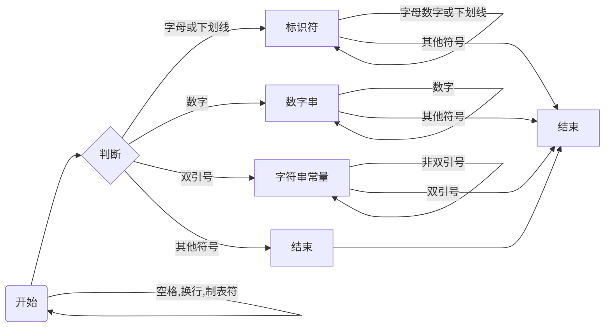

# SysCompiler

    一. 参考编译器介绍：总结所阅读的编译器的总体结构、接口设计、文件组织等内容
    二. 编译器总体设计：介绍自己的将要实现的编译器的总体结构、接口设计、文件组织等内容
    三. 词法分析设计：编码前的设计、编码完成之后的修改
    四. 语法分析设计：编码前的设计、编码完成之后的修改
    五. 错误处理设计：编码前的设计、编码完成之后的修改
    六. 代码生成设计：编码前的设计、编码完成之后的修改
    七. 代码优化设计:  编码前的设计、编码完成之后的修改，未选择MIPS代码生成的同学无需完成此项内容

## 词法分析设计

>**词法分析**是计算机科学中将字符序列转换为**记号**（token）序列的过程。进行词法分析的程序或者函数叫作**词法分析器**（lexical analyzer）词法分析器一般以函数的形式存在，供语法分析器调用。SysYComplier 词法分析器包括CategoryCode、Scanner、Token三类。

### Token

Token 是词法分析的结果的基本单位

```java
public class Token {
    public String value;  // token 所包括的内容
    public String categoryCode; // categoryCode token的类型码
    public int lineNum; // token所在的行号，用于后续的错误处理
}
```

### CategoryCode

```java
public class CategoryCode {
    static public Map<String, String> name2code = new HashMap<>();
    static public String[] name;
    static public String[] code;
    static public String[] reservedWord;
    static public Character[] OneSymbol;
}
```

CategoryCode为静态类，主要用于加载储存文法的一系列规定。对于SysY文法所规定的保留字进行处理。

### Scanner

```java
public class Scanner {
    public String sourceCode;
    private int curPos;
    private final int len;
    private int curLine;
    private final ArrayList<Token> tokenArrayList;
}
```

Scanner 为词法分析的主类，词法分析的主要方法为**有限状态自动机**（finate automaton）。根据SysY所规定的语法，可以构造以下的有限状态机，不断循环，直至文件流扫描结束。



## 语法分析设计

>**语法分析**是编译过程的一个逻辑阶段。 语法分析的任务是在词法分析的基础上将单词序列组合成各类语法短语，如“程序”，“语句”，“表达式”等等. 

为了与后续的处理进行解耦，语法分析的主要任务是建立语法树，将词法分析的token组建成为相应的语法成分。SysYComplier的语法分析器主要使用**递归下降分析方法**。

### 消除左递归

递归下降分析需要非左递归文法，因此语法分析需要对于左递归文法进行相对应的改写。

* **乘除模表达式**: `MulExp → UnaryExp | MulExp ('*' | '/' | '%') UnaryExp`改写为``MulExp → MulExp {('*' | '/' | '%') MulExp}`
* **加减表达式**: `AddExp → MulExp | AddExp ('+' | '−') MulExp `改写为` AddExp → MulExp {('+' | '−') MulExp}`
* **关系表达式**:` RelExp → AddExp | RelExp ('<' | '>' | '<=' | '>=') AddExp`改写为`RelExp → AddExp { ('<' | '>' | '<=' | '>=') AddExp}`
* **相等性表达式** `EqExp → RelExp | EqExp ('==' | '!=') RelExp`改写为`EqExp → RelExp {('==' | '!=') RelExp}`
* **逻辑或表达式** `LOrExp → LAndExp | LOrExp '||' LAndExp`改写为`LOrExp → LAndExp {'||' LAndExp}`
* **逻辑与表达式** `LAndExp → EqExp | LAndExp '&&' EqExp`改写为`LAndExp → EqExp {'&&' EqExp}`

## 五、错误处理设计

## 六. LLVM IR 中间代码生成设计

## 七. 代码优化设计

## 八. LLVM IR MIPS 后端代码生成设计

### 类的设计

* **CodeGen**：后端代码生成主类
* **MipsInstruction**：mips代码类，实际上就是个字符串拼接的抽象，为了让代码可读性更高
* **RegAllocator**：资源管理类，主要功能如下：
  * 管理LLVM虚拟寄存器和栈之间的映射
  * 管理LLVM虚拟寄存器和真实寄存器之间的映射
  * 管理MIPS真实寄存器的释放和申请
  * 管理MIPS栈的释放和申请
* **Mem**：为了让代码有更高的可读性，把字符串封装成三个类，由下列的类组成：
  * RealRegister：用于描述真实mips寄存器，一共32个
  * Stack：用于管理栈地址
  * VirtualRegister：用于描述虚拟寄存器

### 概念辨析

写相关代码之前一定要搞清楚的概念：

* **什么是寄存器分配，为什么要寄存器分配？**

  MIPS系统中内存一共分为两部分：

  * 寄存器（Register）是一种高速的储存设备
  * 栈指针（Stack）普通的内存，再MIPS又被称为Effective Memory

  这两部分其实广义上是一样的，只不过一个速度快一个速度慢而已，我们不能分开来考虑，所以这就产生了一个问题，哪些变量需要快速的存储哪些变量不需要，所以才需要分配寄存器，寄存器分配的对象是LLVM中的虚拟寄存器，不是源码里的寄存器。

* **MIPS和LLVM的区别**
  * MIPS需要我们直接操作内存，LLVM还是停留在宏观的寄存器
  * MIPS的寄存器资源是有限的，LLVM的虚拟寄存器资源是无限的
  * MIPS相对LLVM**需要把动态的东西化成静态的。**

### 总体流程的OverView

经过我两周的摸爬滚打，我将流程确定如下，一共需要过两遍LLVM的中间代码：

* 第一遍是资源分配，也就是通俗意义上的寄存器分配
* 第二遍是代码生成的主要流程

### 寄存器分配

寄存器分配虽然叫寄存器分配，实际上是对内存管理，对于LLVM里的每一个变量映射到合适的位置。

#### Naive 寄存器分配

目前我实现的是最naive的寄存器分配即不分配，所有的变量都存在内存里面，只是使用少量的寄存器作为操作寄存器。所以第一遍做的主要的事情就是计算内存，其中需要用到的内存是：

* **BinaryInstruction**：结果需要存在栈上面，因为有很多无用代码，【这里可以做死代码删除】，导致算出来的结果永远不会用。

  ```
  a+b+c;
  ```

* **CallInstruction**：如果函数调用有结果需要分配内存。
* **AllocateInstruction**：这个是分配的主要场景，数组需要计算大小，变量和地址都是4字节。
* **IcmpInstruction**：这个文法中规定，一定是出现在判断语句中，所以我目前的处理方式是直接放在临时寄存器里，因为他很快会被用掉。

* **保存现场栈**：在调用函数前需要保存现场，我们在没有分配用于储存的寄存器之前，是没办法确定某个函数最多使用多少个寄存器，当然后续做寄存器分配这块儿可以优化，目前固定使用10个寄存器，所以需要预留10*4的空间。

* **函数参数栈**：我目前的解决办法是找到参数最多的函数`f`参数量为`m`，然后对于每一个函数参数栈的大小为`m-4>0?0:m-4`

综上，需要用到内存的就是这些，我们在第一遍扫描的时候需要算出来。

### LLVM 语句翻译

很多细节的东西不具体说了，主要谈一谈，LLVM和MIPS的一些不一样的地方。

#### 保存现场

在调用函数之前，需要把还没有被释放的寄存器，存到实现预留出来的栈里面，当然函数调用之后也别忘了加载回来。

#### load指令

这里面需要注意的是在load函数参数的时候，如果函数参数过多LLVM出现以下情况：

```llvm
    %8 = load i32, i32* %1
    %9 = load i32, i32* %2
    %10 = load i32, i32* %3
    %11 = load i32, i32* %4
    %12 = load i32, i32* %5
    %13 = load i32, i32* %6
    %14 = load i32, i32* %7
    %15 = call i32 @h(i32 %8, i32 %9, i32 %10, i32 %11, i32 %12, i32 %13, i32 %14)
```

这种情况我们需要先把`%1`加载到`$a0`之类的操作，但是由于参数很多寄存器不能得到释放，就会导致错误，所以我们对于是参数的虚拟寄存器要做特殊处理，至于怎么识别是不是参数，可以在第一遍的时候建一个集合，在load的时只存进入符号表，而不是直接翻译，到call语句的时候再翻译。这里又需要注意数组的情况，具体处理方法详见`loadparam`函数。

#### 数组处理

对于数组处理一共分为四种情况：

* 数组是一维数组变量
* 数组是二维数组变量
* 数组是一维数组参数
* 数组是二维数组参数

首先一维数组和二维数组的不同点再于偏移的量不一样，二维数组偏移量需要乘以数组的列数，参数和变量不一样的地方很明显就是getelemptr指令的第二个偏移量参数是空。

其他的指令都是直接翻译就可以了，实际上难度不算特别大，主要是一开始不知道怎么开始，希望我这个小小总结有点用处，更多的还是看看我的代码，毕竟注释还算详细。
