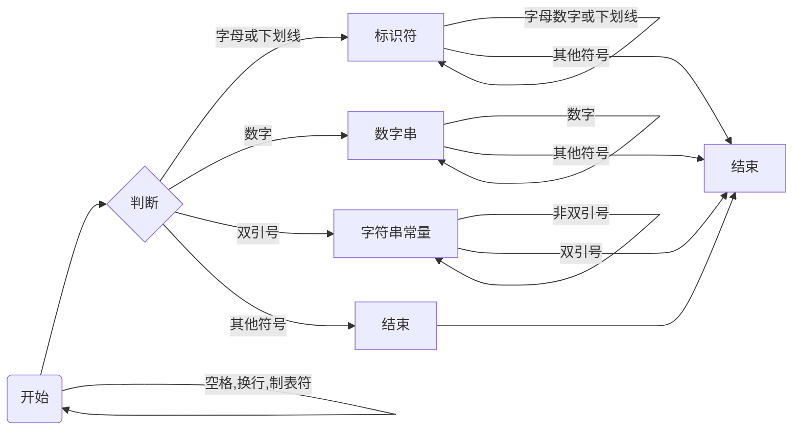

# SysComplier

    一. 参考编译器介绍：总结所阅读的编译器的总体结构、接口设计、文件组织等内容
    二. 编译器总体设计：介绍自己的将要实现的编译器的总体结构、接口设计、文件组织等内容
    三. 词法分析设计：编码前的设计、编码完成之后的修改
    四. 语法分析设计：编码前的设计、编码完成之后的修改
    五. 错误处理设计：编码前的设计、编码完成之后的修改
    六. 代码生成设计：编码前的设计、编码完成之后的修改
    七. 代码优化设计:  编码前的设计、编码完成之后的修改，未选择MIPS代码生成的同学无需完成此项内容

## 词法分析设计

>**词法分析**是计算机科学中将字符序列转换为**记号**（token）序列的过程。进行词法分析的程序或者函数叫作**词法分析器**（lexical analyzer）词法分析器一般以函数的形式存在，供语法分析器调用。SysYComplier 词法分析器包括CategoryCode、Scanner、Token三类。

### Token

Token 是词法分析的结果的基本单位

```java
public class Token {
    public String value;  // token 所包括的内容
    public String categoryCode; // categoryCode token的类型码
    public int lineNum; // token所在的行号，用于后续的错误处理
}
```

### CategoryCode

```java
public class CategoryCode {
    static public Map<String, String> name2code = new HashMap<>();
    static public String[] name;
    static public String[] code;
    static public String[] reservedWord;
    static public Character[] OneSymbol;
}
```

CategoryCode为静态类，主要用于加载储存文法的一系列规定。对于SysY文法所规定的保留字进行处理。

### Scanner

```java
public class Scanner {
    public String sourceCode;
    private int curPos;
    private final int len;
    private int curLine;
    private final ArrayList<Token> tokenArrayList;
}
```

Scanner 为词法分析的主类，词法分析的主要方法为**有限状态自动机**（finate automaton）。根据SysY所规定的语法，可以构造以下的有限状态机，不断循环，直至文件流扫描结束。



## 语法分析设计

>**语法分析**是编译过程的一个逻辑阶段。 语法分析的任务是在词法分析的基础上将单词序列组合成各类语法短语，如“程序”，“语句”，“表达式”等等. 

为了与后续的处理进行解耦，语法分析的主要任务是建立语法树，将词法分析的token组建成为相应的语法成分。SysYComplier的语法分析器主要使用**递归下降分析方法**。

### 消除左递归

递归下降分析需要非左递归文法，因此语法分析需要对于左递归文法进行相对应的改写。

* **乘除模表达式**: `MulExp → UnaryExp | MulExp ('*' | '/' | '%') UnaryExp`改写为``MulExp → MulExp {('*' | '/' | '%') MulExp}`
* **加减表达式**: `AddExp → MulExp | AddExp ('+' | '−') MulExp `改写为` AddExp → MulExp {('+' | '−') MulExp}`
* **关系表达式**:` RelExp → AddExp | RelExp ('<' | '>' | '<=' | '>=') AddExp`改写为`RelExp → AddExp { ('<' | '>' | '<=' | '>=') AddExp}`
* **相等性表达式** `EqExp → RelExp | EqExp ('==' | '!=') RelExp`改写为`EqExp → RelExp {('==' | '!=') RelExp}`
* **逻辑或表达式** `LOrExp → LAndExp | LOrExp '||' LAndExp`改写为`LOrExp → LAndExp {'||' LAndExp}`
* **逻辑与表达式** `LAndExp → EqExp | LAndExp '&&' EqExp`改写为`LAndExp → EqExp {'&&' EqExp}`

五、错误处理设计


六. 代码生成设计


七. 代码优化设计